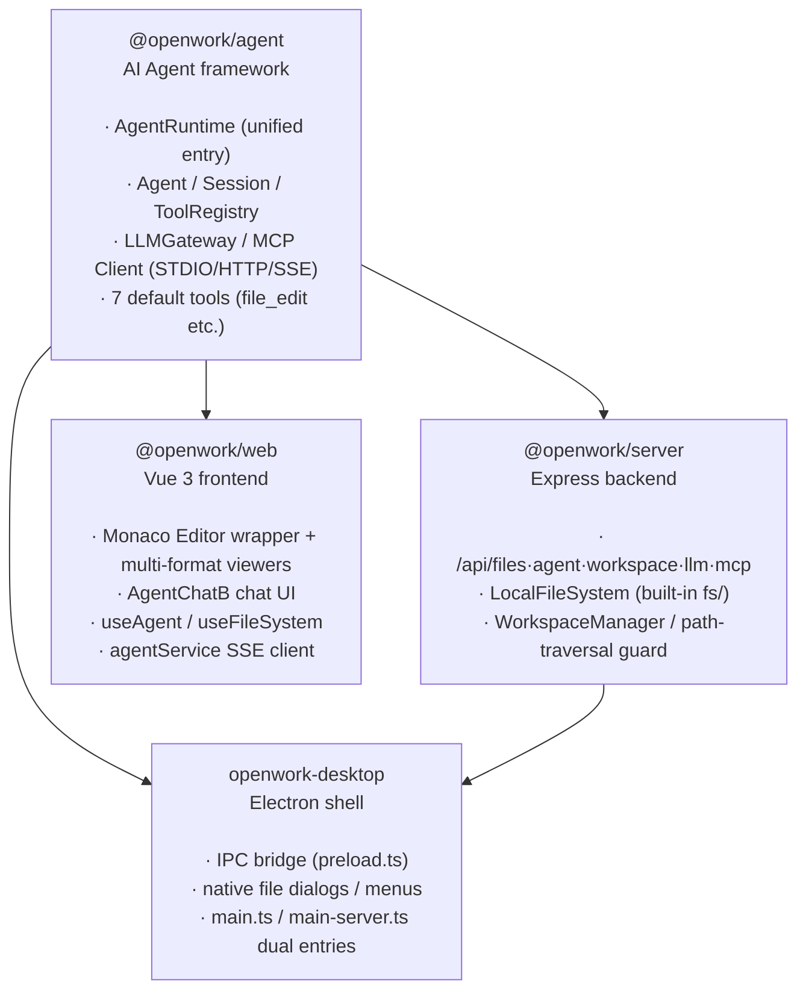
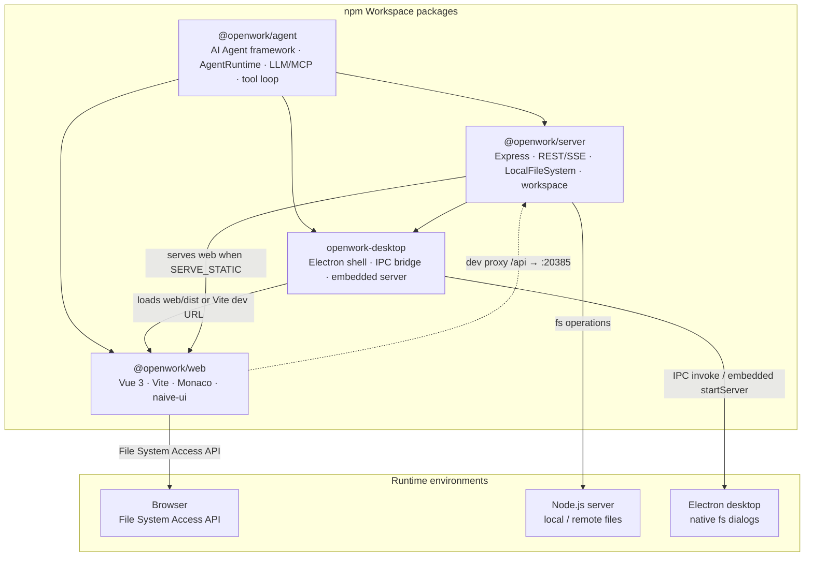
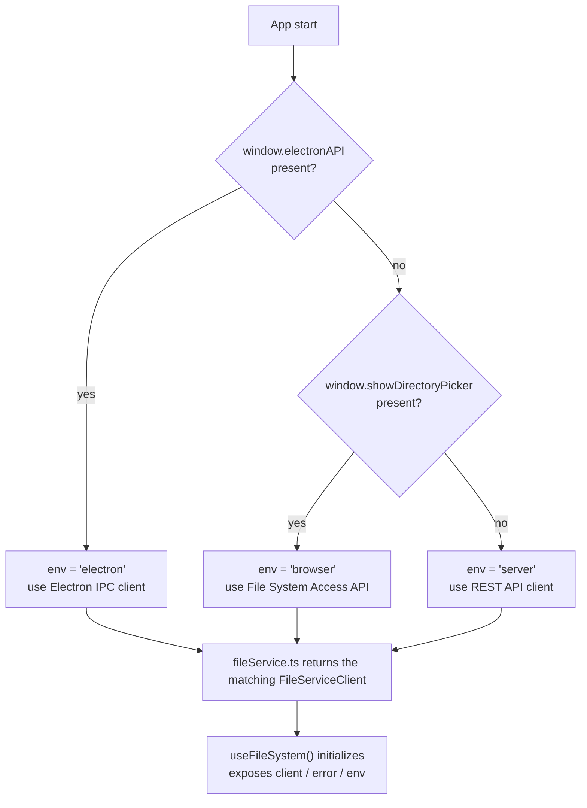
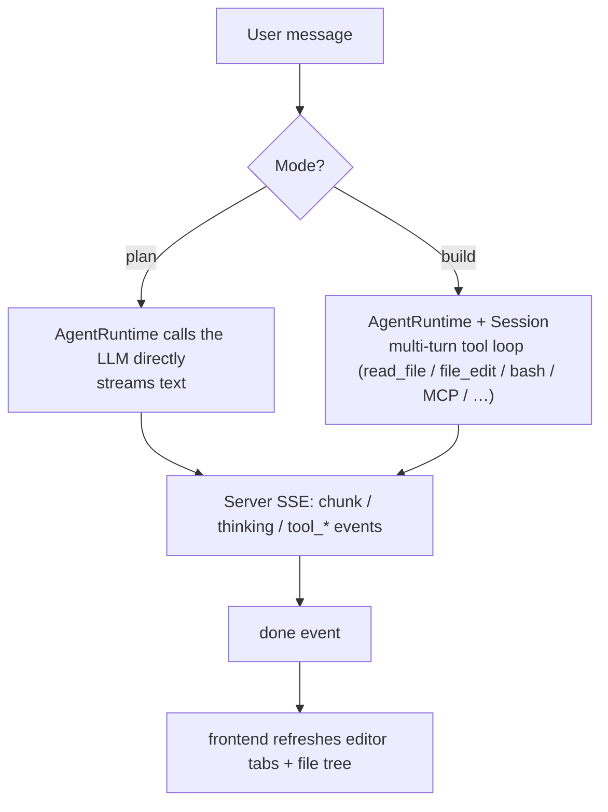
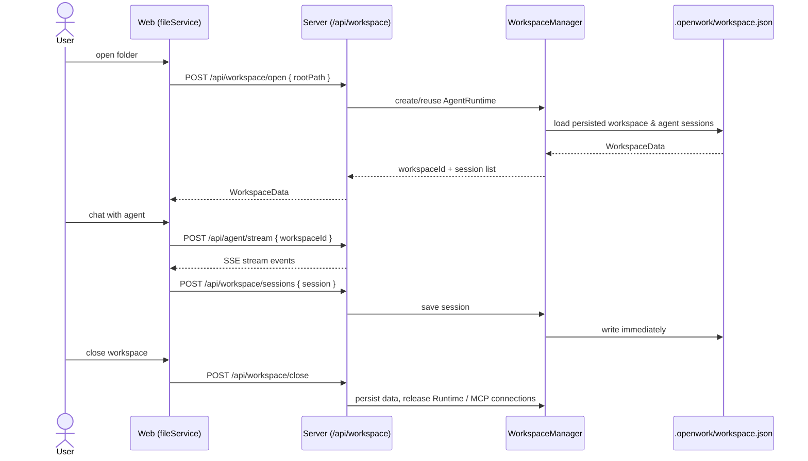

# OpenWork

> [中文](README.md)

A **general-purpose AI-powered office workbench** built with **Monaco Editor** + **Vue 3** — view and work with all kinds of files (code, Word, Excel, PPT, PDF, Markdown, HTML, images) in one unified workspace, and ask the AI assistant to perform tasks — file read/write, command execution, external tool calls — in natural language. Supports both **server deployment** (browser access) and **Electron desktop**.


## Quick Start · Build & Deploy

### Install

```bash
npm install
```

### Develop

There are only **two** dev modes:

| Mode | Command | Notes |
|------|---------|-------|
| **Server (separated frontend/backend)** | `npm run dev:all` | Starts the Express backend (`http://localhost:20385`) and the Vite frontend (`http://localhost:5173`) together; they talk over the `/api` proxy. Suited to browser / remote deployment |
| **Electron desktop** | `npm run dev:electron` | Starts the Vite frontend + an Electron window; local files are read/written via main-process IPC (`main.ts` entry) |

> Both commands auto-build `@openwork/agent` first.

To **test the agent module on its own** (without launching the UI), use the interactive CLI:

```bash
npm run cli          # Interactive Agent CLI (supports MCP tools)

# Pass the model under test (CLI flags > env vars LLM_API_URL/LLM_MODEL/LLM_API_KEY > built-in defaults)
npm run cli -- --url https://api.deepseek.com/v1 --model deepseek-v4-flash --key sk-xxxx
```

> The CLI no longer ships a hardcoded API key — provide one via `--key` or the `LLM_API_KEY` env var. The model is invoked through `AgentRuntime`.

### Build

```bash
npm run build:all       # Build everything (agent → web → server → electron)

# Or build individually
npm run build:agent     # AI Agent framework
npm run build:server    # Express backend
npm run build:web       # Vue frontend (output to packages/web/dist/)
npm run build:electron  # Electron main process
```

### Deploy

| Target | Command | Notes |
|--------|---------|-------|
| **Server deployment** | `npm run build:all` + `SERVE_STATIC` | After building, start the server with `SERVE_STATIC` pointing to `packages/web/dist` so Express serves both the frontend and the API |
| **Electron unpacked dir** | `npm run pack:electron` | electron-builder `--dir` mode: produces the unpacked app directory only, **no installer** — for verifying the package locally |
| **Electron installer** | `npm run dist:electron` | Full electron-builder packaging: produces a distributable **Windows NSIS installer** |

> Electron has two main-process entries: `main.ts` (standard window, IPC file operations) and `main-server.ts` (embedded Express server) — see [packages/electron/README.md](packages/electron/README.md). The frontend auto-detects the runtime environment (Electron / Server / Browser) and selects the appropriate file service at `packages/web/src/services/fileService.ts`.

## Features & Development Status

> **Legend**: ✅ Done &nbsp; ⚠️ Framework ready, needs implementation &nbsp; ❌ Not started

### P0 — File Workbench & Multi-format Viewing

| # | Feature | Status | Notes |
|---|---------|--------|-------|
| 1 | Multi-tab management / dirty flag | ✅ | Pinia store driven, `packages/web/src/stores/editor.ts` |
| 2 | Open file (local / remote) | ✅ | Electron IPC + Server API working; browser File System Access API partially usable |
| 3 | Open folder (file tree) | ✅ | Electron `showOpenDialog` + Server `/api/files/list` working; browser side incomplete |
| 4 | Save file (Ctrl+S) | ✅ | Electron IPC + Server API both implemented |
| 5 | New untitled file | ✅ | `store.newUntitled()` |
| 6 | Drag and drop files to open | ✅ | `MainLayout.vue` with visual drop overlay; supports both Electron (native paths) and browser (FileSystemDirectoryHandle) |
| 7 | Keyboard shortcuts | ⚠️ | Copy (Ctrl+C), Paste (Ctrl+V), Cut (Ctrl+X), Undo (Ctrl+Z), Redo (Ctrl+Y), Find (Ctrl+F), Replace (Ctrl+H) bound; Electron menu shortcut IPC bridge ready but unused; full shortcut system missing |
| 8 | Multi-format document viewing | ✅ | 8 render modes: code / Word / Excel / PPT / PDF / Markdown / HTML / image, picked by file extension (see "Multi-format viewers" below) |
| 9 | Workspace-wide content search | ✅ | `SearchPanel.vue` recursively searches all workspace files, results grouped by file, click-to-navigate (read-only, no replace) |
| 10 | Single-file find / replace | ⚠️ | Monaco built-in find/replace (Ctrl+F / Ctrl+H) works; the search panel itself is read-only |

### P1 — AI Assistant

| # | Feature | Status | Notes |
|---|---------|--------|-------|
| 11 | Agent chat panel | ✅ | `AgentChatB.vue` (naive-ui), build / plan modes, Markdown + KaTeX rendering, multi-session tabs, multi-provider config |
| 12 | Agent streaming response (SSE) | ✅ | Server SSE + frontend stream parsing fully working with real LLM backend (chunk / thinking / tool_* / done events) |
| 13 | Agent tool loop for task execution | ✅ | `@openwork/agent` ships 7 built-in tools (`file_edit` / `file_write` / `read_file` / `list_dir` / `search_code` / `bash` / `delegate`) that write files directly inside the tool loop; no separate `<edit>`-block pipeline |
| 14 | Agent context builder (open files + cursor + selection) | ✅ | `useAgent.ts` builds an `IDESnapshot` (active file, other tabs, file tree, cursor/selection) and sends it with each request |
| 15 | MCP tool ecosystem | ✅ | Full MCP client supporting STDIO / HTTP / SSE transports; multi-server connection, tool discovery and routing; frontend management panel |
| 16 | LLM backend integration (OpenAI-compatible API) | ✅ | Built on the `openai` SDK, works with DeepSeek / Ollama / vLLM etc.; `systemPrompt` is configurable |
| 17 | Multi-provider configuration | ✅ | `LLMGateway` CRUD, active-provider selection, connectivity/model-list testing, persisted to `config/llm-settings.json` |
| 18 | Session persistence | ✅ | Server persists agent sessions (including memory) to `.openwork/workspace.json`; re-opening the workspace restores them |
| 19 | Sub-agent delegation | ⚠️ | `DelegateTool` + `Session` orchestration implemented (`<delegate>` routing); no dedicated frontend display |
| 20 | Edit undo / redo | ⚠️ | Monaco native text-level undo/redo bound; deleted files can be restored within 10s (`undoDelete()`); no separate undo API for agent edits |

### P2 — File System & Workspace

| # | Feature | Status | Notes |
|---|---------|--------|-------|
| 21 | Three file system implementations | ✅ | `LocalFileSystem` (server `fs/`) + browser FSA client + REST client (web `fileService.ts`) |
| 22 | Runtime environment auto-detection | ✅ | `fileService.ts` → detect Electron / Server / Browser |
| 23 | File / folder rename / delete / create | ✅ | Backend API implemented; file-tree context menu and File menu integrated |
| 24 | File watching / auto-refresh | ⚠️ | `IFileSystem.watch()` defined, `LocalFileSystem` implemented; frontend not consuming |
| 25 | Recent projects / files list | ❌ | |
| 26 | Frontend UI state persistence (restore tabs after restart) | ❌ | Pinia store is in-memory only, lost on refresh (only LLM provider configs persist to localStorage); server-side workspace and agent sessions ARE persisted |

### P3 — Code Editing Enhancements

> Code is one of OpenWork's 8 view modes (Monaco Editor); the items below are capabilities inside the code viewer.

| # | Feature | Status | Notes |
|---|---------|--------|-------|
| 27 | Code folding / outline | ✅ | Native Monaco support |
| 28 | Multi-cursor editing | ✅ | Native Monaco support |
| 29 | Theme switching (light/dark/custom) | ✅ | dark/light/blue themes, persisted to localStorage, synced with Monaco |
| 30 | Syntax errors / diagnostics | ❌ | Needs a TypeScript/ESLint Language Server |
| 31 | Code completion / IntelliSense | ⚠️ | Monaco built-in basic completion; TypeScript smart completion not configured |
| 32 | Snippets | ❌ | |
| 33 | Formatting (Prettier integration) | ❌ | Prettier installed as a devDependency but never invoked |

### P4 — Deployment & Distribution

| # | Feature | Status | Notes |
|---|---------|--------|-------|
| 34 | Server deployment (Express + static frontend) | ✅ | `SERVE_STATIC` env var points to `web/dist` |
| 35 | Electron desktop app | ✅ | dev/prod modes, IPC file operations, file dialogs, multiple windows |
| 36 | Electron native menu bar | ✅ | File/Edit/Help menus with shortcuts, implemented in both `main.ts` and `main-server.ts` |
| 37 | Electron packaging / installer (electron-builder) | ⚠️ | `build` field configured (appId, productName, win NSIS / linux AppImage+deb, icons); packaging not verified in CI |
| 38 | Path traversal protection | ✅ | Server file routes use `resolve` → `startsWith` validation |
| 39 | Authentication (Bearer token) | ✅ | `authMiddleware` mounted on `/api/*`; set the `AUTH_TOKEN` env var to enable Bearer checks (unset = open locally; must be set for remote deployments) |
| 40 | Docker deployment | ❌ | |
| 41 | CI/CD (GitHub Actions) | ❌ | |

### P5 — UX & Engineering

| # | Feature | Status | Notes |
|---|---------|--------|-------|
| 42 | Adaptive layout (draggable splitter) | ✅ | `MainLayout.vue` — adjustable sidebar width |
| 43 | Status bar (cursor position, language, encoding) | ✅ | Custom `StatusBar.vue` showing language, live line/column, workspace mode |
| 44 | Context menu | ✅ | File-tree right-click menu (`NewFileTree` with built-in naive-ui menu): open/rename/delete/create/cut/copy/paste/copy path/refresh |
| 45 | Error / notification toasts | ❌ | `useFileSystem.error` defined but not rendered anywhere |
| 46 | Loading states / skeletons | ⚠️ | File tree and agent panel have text "Loading..." hints; no skeletons/animations |
| 47 | Internationalization (i18n) | ✅ | Chinese/English via vue-i18n, persisted to localStorage, covers all UI text |
| 48 | Responsive / mobile adaptation | ❌ | Only a `<meta viewport>` tag; no @media queries |
| 49 | Automated tests | ⚠️ | `@openwork/agent` has vitest unit tests (16 cases: SessionMemory / createDefaultTools / maskApiKey); web / server have none |
| 50 | ESLint / Prettier config | ❌ | Dependencies installed, no config files (`npm run lint` fails) |

### Statistics

| Status | Count |
|--------|-------|
| ✅ Done | 31 |
| ⚠️ Framework ready | 9 |
| ❌ Not started | 10 |
| **Total** | **50** |

## Multi-format Viewers

Each tab picks its renderer by file extension (`getViewModeFromPath()`, defined in `stores/editor.ts`):

| Format | Renderer | Implementation |
|--------|----------|----------------|
| Code (ts/js/json/py/rs/go/…) | `MonacoEditor.vue` | Monaco Editor: syntax highlighting, folding, multi-cursor, vs-dark theme |
| Word (docx) | `DocxViewer.vue` | `docx-preview` with zoom / fit-to-width / headers-footers / footnotes (legacy `.doc` unsupported) |
| Excel (xlsx/xls) | `ExcelViewer.vue` | `@vue-office/excel` |
| PowerPoint (pptx/ppt) | `PptxViewer.vue` | `@vue-office/pptx` |
| PDF | `PdfViewer.vue` | Embedded via `<embed>` |
| Markdown (md/mdx) | `MarkdownViewer.vue` | markdown-it + KaTeX math |
| HTML | `HtmlViewer.vue` | iframe live preview |
| Images (png/jpg/gif/svg/webp/bmp/ico/tiff) | `ImageViewer.vue` | Native `` |

## Architecture

### 1. Package dependency graph

> Arrow direction: `A --> B` means B depends on A (A is the dependency)



> There are **4 workspace packages** (`agent` / `server` / `web` / `electron`); `@openwork/core` does not exist.

**Key points**:
- **`@openwork/agent`** is the core module with `AgentRuntime` as its unified entry; it depends on no workspace package and is decoupled from platforms via the `IAgentFileSystem` interface
- **File-system implementations live with their consumers**: `LocalFileSystem`/`FileEntry` live in `@openwork/server`'s `fs/`; the browser FSA client and REST client live in `@openwork/web`'s `fileService.ts`; the tab type (`EditorTab`, with its `viewMode` renderer selection) lives in `@openwork/web`'s Pinia store
- **`@openwork/server`** depends on `@openwork/agent` and provides the full REST·SSE API for files / agent / workspace / LLM / MCP
- **`openwork-desktop`** (Electron) can embed `@openwork/server` (`main-server.ts`) or use IPC file operations only (`main.ts`)

### 2. Architecture diagram — package dependencies & deployment topology



**Notes**: `@openwork/agent` is a standalone AI agent framework with `AgentRuntime` as its unified entry, providing LLM provider management, a multi-turn tool loop, an MCP client, and file-operation execution. `@openwork/server` depends on agent and ships `LocalFileSystem` (`fs/`) plus workspace management. The `web` frontend proxies `/api` to `server` via Vite in dev; in Electron mode the frontend is loaded by the Electron window and file operations go through the IPC bridge exposed by `preload.ts`, or through the Express server embedded by `main-server.ts`.

### 3. Flowcharts

#### 3.1 Runtime detection & file-service selection



**Notes**: `detectEnvironment()` in `fileService.ts` detects and caches the runtime once, in the order `electron → browser → server`. All file operations go through the uniform `FileServiceClient` interface; upper components never branch on the environment.

#### 3.2 Agent conversation & task execution flow



**Notes**: All agent logic runs inside `AgentRuntime` in `@openwork/agent` (the server holds the instance). `plan` mode streams directly from the LLM; `build` mode runs the multi-turn tool loop. File edits are written by the built-in tools (`FileEditTool` / `FileWriteTool`) directly inside the loop (with a read-first guard), after which the frontend refreshes the UI.

### 4. Sequence diagram — workspace open & agent session persistence



**Notes**: The server reuses `AgentRuntime` (including MCP connections) per `workspaceId`. Agent conversation history is persisted with the workspace data into `.openwork/workspace.json` under the workspace directory; reopening the workspace restores the sessions.

### 5. Core types overview

**File-system abstraction layer:**

| Interface/Class | Package | Purpose |
|-----------------|---------|---------|
| `IAgentFileSystem` | `@openwork/agent` | Minimal file-system interface (readFile / writeFile / exists / readDir) |
| `IFileSystem` / `LocalFileSystem` | `@openwork/server` | Server-side file-system interface and Node.js `fs/promises` implementation (`fs/`) |
| `FileServiceClient` | `@openwork/web` | Uniform frontend file client interface (Electron IPC / Server REST / Browser FSA) |

**Agent / AI layer (all in `@openwork/agent`):**

| Interface/Class | Purpose |
|-----------------|---------|
| `AgentRuntime` | **Unified entry**: plan/build modes, session management, MCP integration, file-operation execution |
| `Agent` | Single-agent multi-turn tool-calling loop |
| `Session` | Main + sub-agent orchestration, `<delegate>` routing, streaming |
| `ToolRegistry` / `ITool` | Tool registry and tool interface (7 default tools) |
| `McpManager` | Multi-MCP-server connection management, tool discovery and routing |
| `LLMGateway` | LLM provider configuration management and persistence |
| `SessionMemory` | Session memory: messages, tool-call records, token-budget management |

**Tabs & editor state:**

| Interface/Class | Package | Purpose |
|-----------------|---------|---------|
| `AgentContext` | `@openwork/agent` | Agent context (openFiles / fileTree / cursorPosition etc.) |
| `ChatResult` / `AgentResult` | `@openwork/agent` | Chat result (text, tool-call records) |
| `EditorTab` / `ViewMode` | `@openwork/web` | Tab (with viewMode renderer selection, defined in `stores/editor.ts`) |
| `EditorStore` | `@openwork/web` | Pinia store — the single source of frontend state (tabs / fileTree / workspace) |

## Server API

| Method | Endpoint | Purpose |
|--------|----------|---------|
| GET | `/api/files/list?path=&root=` | List directory contents |
| GET | `/api/files/read?path=&root=` | Read file content |
| GET | `/api/files/read-buffer?path=&root=` | Read file as base64 (binary files) |
| POST | `/api/files/write` | Write file `{ path, content, root }` |
| DELETE | `/api/files/delete?path=&root=` | Delete file |
| POST | `/api/files/mkdir` | Create directory `{ path, root }` |
| DELETE | `/api/files/rmdir?path=&root=` | Delete directory |
| GET | `/api/files/exists?path=&root=` | Check whether a path exists |
| GET | `/api/files/stat?path=&root=` | Get file/directory metadata |
| POST | `/api/files/rename` | Rename `{ oldPath, newPath, root }` |
| POST | `/api/agent/chat` | Send a message to the agent |
| POST | `/api/agent/stream` | Stream the agent response (SSE) |
| GET/POST | `/api/workspace/open·info·update·close` | Workspace lifecycle management |
| GET/POST/DELETE | `/api/workspace/sessions` | Agent session persistence (CRUD) |
| GET | `/api/workspace/roots·browse` | System root list / browse the file system |
| GET/POST/PUT/DELETE | `/api/llm/providers` | LLM provider CRUD + set-active + connectivity test |
| GET/POST/PUT/DELETE | `/api/mcp/servers` | MCP server CRUD + `/test` + `/tools` |
| GET | `/api/config/:filename` | Read a config file |
| PUT | `/api/config/:filename` | Write a config file |
| GET | `/api/health` | Health check |

> Full request/response fields and examples: see [`packages/server/README.md`](packages/server/README.md).

## MCP (Model Context Protocol) Support

OpenWork ships a full MCP client for connecting external tools via the standard protocol.

**Transports:**

| Mode | Use case |
|------|----------|
| **STDIO** | Local MCP server (child process) |
| **HTTP** | Remote MCP server (HTTP POST, stateless) |
| **SSE** | Remote MCP server (Server-Sent Events, auto-extracts `Mcp-Session-Id`) |

**Core classes:**
- `McpManager` — multi-server lifecycle: connect, discover tools, route calls automatically
- `MCPClient` — single-server connection (initialize → `tools/list` → `tools/call`)
- `MCPToolAdapter` — bridges MCP `tools/call` to the `ITool` interface, with automatic argument coercion
- `ToolCatalog` — read-only flat tool-metadata store for display / CLI output

**Usage example (multi-server):**
```ts
const manager = new McpManager();
await manager.connectAll({
  mcpServers: {
    filesystem: { type: 'stdio', command: 'npx', args: ['-y', '@anthropic/mcp-server-filesystem'] },
    remote: { type: 'sse', url: 'https://example.com/mcp', headers: { Authorization: 'Bearer xxx' } },
  },
});
const tools = await manager.discoverAndCreateAdapters();
tools.forEach(t => agent.registerTool(t));
```

**Integration points:**
- The server SSE endpoint (`routes/agent.ts`) reads `mcpConfig` from the request body, connects the servers, and registers their tools with the agent
- The CLI (`cli.ts`) supports interactive MCP tool calls
- The frontend `McpSettingsPanel.vue` manages MCP server configuration

## Environment Variables

| Variable | Consumer | Purpose | Default |
|----------|----------|---------|---------|
| `LLM_API_URL` | `openai-client.ts` | LLM provider API URL | `https://api.openai.com/v1` |
| `LLM_API_KEY` | `openai-client.ts` | LLM provider API key | (empty) |
| `LLM_MODEL` | `openai-client.ts` | LLM model name | `gpt-4o` |
| `SERVER_PORT` / `PORT` | `server/run.ts`, `electron/main-server.ts` | Server port | `20385` (`app-config.json`) |
| `SERVE_STATIC` | `server/run.ts` | Static frontend path (production) | (empty) |
| `VITE_DEV_SERVER_URL` | `electron/main.ts`, `electron/main-server.ts` | Vite dev server URL | `http://localhost:5173` |
| `AUTH_TOKEN` | `middleware/auth.ts` | Bearer token; mounted on `/api/*`, enables checks when set (open locally by default) | (empty) |
| `OPENWORK_ENABLE_BASH` | `tools/index.ts` | Set to `0`/`false` to disable the agent's bash tool (recommended for remote deployments) | (empty) |
| `ELECTRON_MIRROR` | npm install | Electron binary download mirror (for users in China) | (empty) |

Config precedence: explicit arguments > environment variables > defaults

## Project Structure

The repo is an npm workspace with **4 packages** (each has its own README; the table below is an overview):

| Package | Role | Key contents | Docs |
|---------|------|--------------|------|
| `@openwork/agent` | AI Agent framework | `AgentRuntime` (unified entry), `Agent`/`Session`, 7 default tools (file_edit/file_write/read_file/list_dir/search_code/bash/delegate), `McpManager`, `LLMGateway`, `SessionMemory`, `parseToolCalls`, structured logging, CLI | [packages/agent/README.md](packages/agent/README.md) |
| `@openwork/server` | Express backend | `createApp`/`startServer`, `fs/` (`LocalFileSystem`), `routes/` (files·agent·workspace·llm·mcp·config), `WorkspaceManager`, request-logging & Bearer auth middleware | [packages/server/README.md](packages/server/README.md) |
| `@openwork/web` | Vue 3 frontend | `MonacoEditor` + 7 document/image/preview viewers, `AgentChatB` chat panel, file tree, MCP/settings panels, `composables/`, `services/` (`fileService` etc.), `stores/` (editor/sessions/settings), i18n | [packages/web/README.md](packages/web/README.md) |
| `openwork-desktop` | Electron shell | `main.ts`/`main-server.ts` dual entries, `preload.ts` (`window.electronAPI`), `ipc/file-handler.ts`, native menus, `openwork://` protocol | [packages/electron/README.md](packages/electron/README.md) |

> Note: `@openwork/core` from early docs no longer exists — the file-system implementations (`LocalFileSystem`/`FileEntry`) were merged into `@openwork/server`'s `fs/`, and the tab types were merged into `@openwork/web`'s Pinia store.

---

> See [CONTRIBUTING.md](CONTRIBUTING.md) for the contributor guide — script reference, branching/commit workflow, and development conventions.
